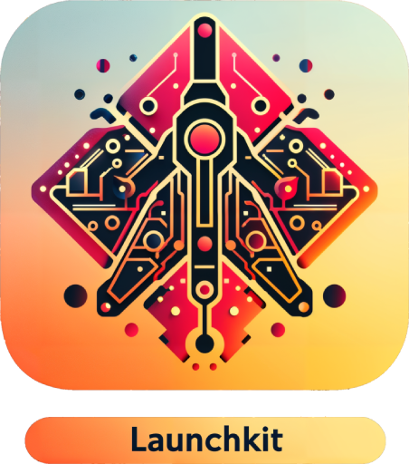

# LaunchKit

<p align="center">
  
</p>

LaunchKit is an open-source library that enables developers to create and manage Python tools which enhance GPT chatbots' capabilities. It turns your Python code into a format that AI systems like OpenAI's GPT can understand and use, thanks to the generation of JSON schemas driven by your code's type annotations.

Using Pydantic, LaunchKit reads your code's structure and details, ensuring that bots can interact with your tools correctly. This process provides clear, enforceable contracts between your functions and chatbots, making your bots smart and reliable.

#### With Launchkit, you can:

1. Write Python functions that can be invoked by your chatbot.
2. Talk/test your bot locally in the terminal.
3. Deploy your bot with MissionControl to Discord, Slack and Telegram.

## Toy Example

```python
from launchkit import LaunchKit

def add(a: int, b: int):
    """Adds two numbers together."""
    return a + b

# async functions are also supported
async def fetch_today_weather():
    """Gets today's weather."""
    await some_async_function()
    return {
        "temperature": 20,
        "humidity": 50
    }

tools = LaunchKit([add, fetch_today_weather])

tools.openai_tools() # list of tools in OpenAI format - ready to be sent to the API.
```

Talk with your bot locally in the terminal:

```bash
launchkit module_name:tools
```

## Getting started

1. Install [PDM](https://pdm-project.org/latest/#installation)

2. Create a new project

```bash
mkdir my_project
cd my_project
pdm init --copier gh:missioncontrolai/template
pdm install
```

3. Test it out

```bash
pdm test # run tests
pdm dev # talk with your bot
```

4. Deploy it (with MissionControl)

```bash
git init
git add .
git commit -m "Initial commit"
```

- Create a new repo on github and push to it.
- Create a Discord bot and save the token.
- Go to https://www.missioncontrolbot.com/ and add your repo.

## First Steps

### Create functions

```python
def add(a: int, b: int): # use a descriptive name and type annotations
    """Adds two numbers together.""" # add a docstring
    return a + b
```

- **The function's name will be used as the tool's name. The docstring will be used as the tool's description.**
- **Use type annotations([More on types](https://fastapi.tiangolo.com/python-types/)) to help the bot understand what kind of data to send to your function.**

Async functions are also supported:

```python
async def fetch_today_weather():
    """Gets today's weather."""
    await some_async_function()
    return {
        "temperature": 20,
        "humidity": 50
    }
```

- **Return type should be serializable to JSON.**

> [!TIP]
> When returning a dictionary, make sure that the fiels names are descriptive. The bot will use them to generate better summaries to function execution results.

### Exposing your functions to the bot

```python
from launchkit import LaunchKit

tools = LaunchKit([add, fetch_today_weather])
```

### Testing

Talk with your bot locally in the terminal:

```bash
launchkit module_name:tools
```

Write [tests](https://docs.pytest.org/) for your functions:

```python
def test_add():
    assert add(1, 2) == 3
```

### Summary

- Use descriptive names
- Add docstrings
- Use type annotations
- Return type should be serializable to JSON
